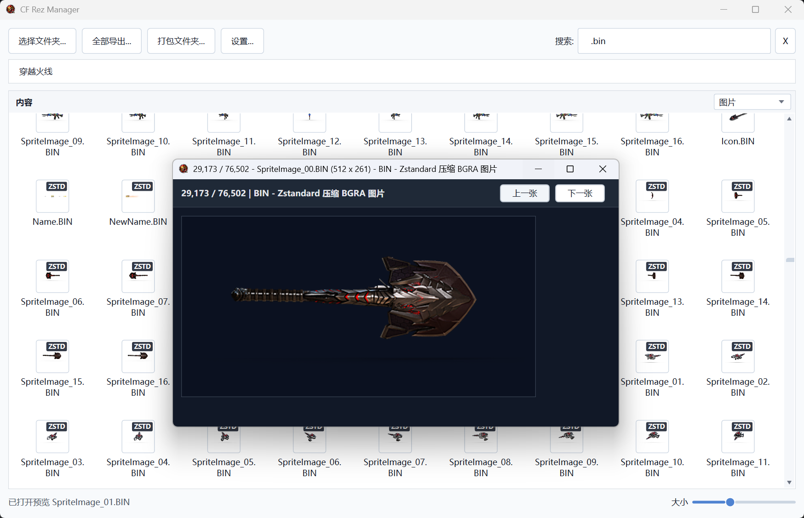
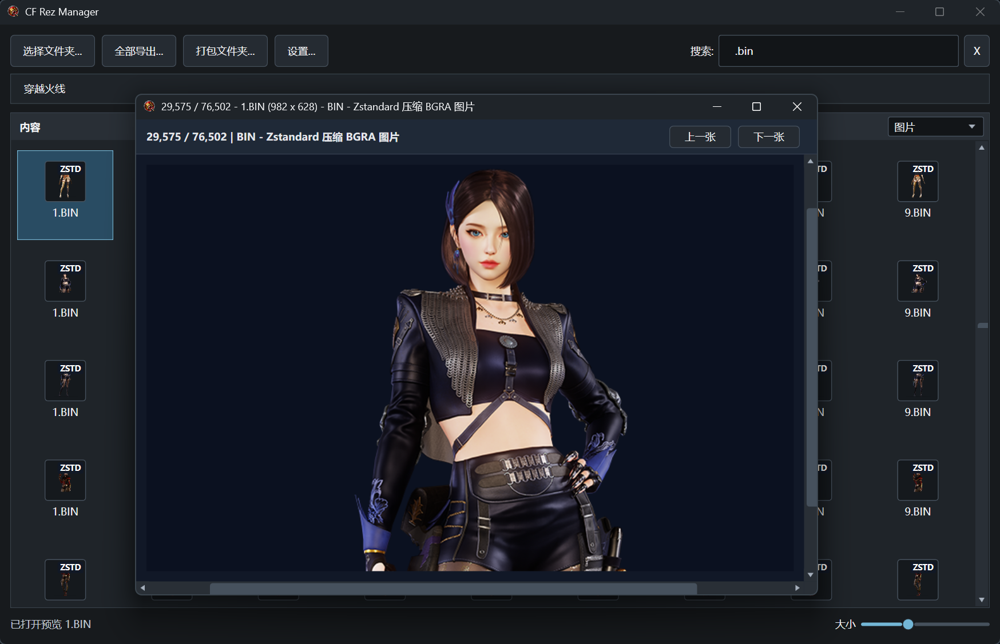
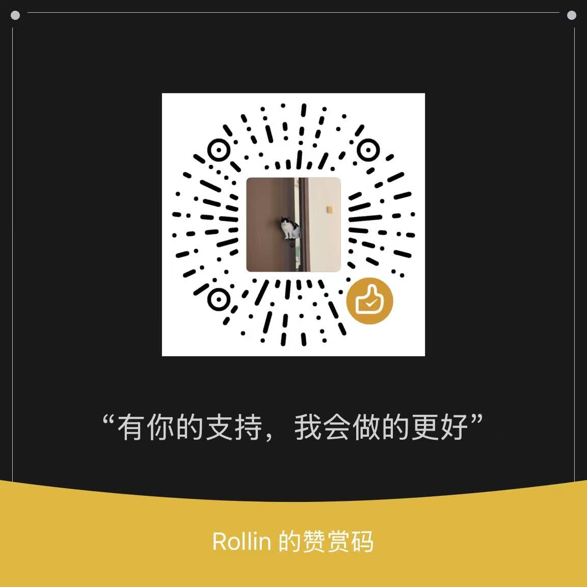

# CF Rez Manager

中文点这里 [README.md](README.md).




CF Rez Manager is a Windows WPF tool for browsing, searching, previewing, extracting, and packing LithTech / CrossFire `.rez` archives. It can also inspect loose resource files from extracted folders.

## What It Does

- Browse `.rez` archives, internal REZ folders, and normal resource folders.
- Search files, folders, and internal REZ paths with multi-keyword filtering.
- Export all resources, or only selected files, folders, and REZ entries.
- Pack a normal Windows folder into a new `.rez` archive.
- Preview images, textures, audio, models, maps, script configs, and common CrossFire/LithTech resources.
- Choose per format whether decodable image resources such as BIN, DTX, TGA, and DDS are exported as source files or standard `.png` files.
- Provide command-line batch entry points for OBJ/MTL model export, CFG scanning, and CFG decoding.

## Requirements

- Windows
- .NET 8 SDK or .NET 8 Runtime

## Build And Run

```powershell
dotnet build .\CFRezManager.csproj
```

Run the app from Visual Studio, or start the built executable:

```text
bin\Debug\net8.0-windows7.0\CFRezManager.exe
```

## Project Structure

```text
CFRezManager/
|-- App.xaml
|-- App/
|-- Archives/
|-- Commands/
|-- Decoders/
|   |-- Audio/
|   |-- Compression/
|   |-- Config/
|   |-- CrossFire/
|   |-- Fmod/
|   |-- Images/
|   |-- LithTech/
|   |   `-- Models/
|   `-- Text/
|-- Explorer/
|-- Preview/
|   |-- Audio/
|   |-- Image/
|   |-- Model/
|   `-- Text/
|-- UI/
|-- assets/
|-- CFRezManager.csproj
`-- CFRezManager.sln
```

- `App/`: startup helpers, settings, localization, and assembly metadata.
- `Archives/`: REZ reading, writing, and directory-table encryption logic.
- `Commands/`: command-line entry points for OBJ export, CFG scan/decode, and standalone preview.
- `Decoders/`: resource decoders grouped by audio, images, CrossFire, LithTech, text, and related formats.
- `Explorer/`: resource browser item model and thumbnail cache.
- `Preview/`: standalone preview windows for audio, images, models, and text.
- `UI/`: main window and UI controls.
- `assets/`: app icon and image resources copied with the app.

## Basic Use

1. Start the program.
2. Select a folder that contains `.rez` files or loose resources.
3. Double-click a folder, REZ archive, internal REZ folder, or supported preview file.
4. Use the breadcrumb bar to move back or jump to a parent location.

Click `Settings...` in the top toolbar to open the settings window, where you can switch between `Chinese` / `English`, `Light` / `Dark` themes, configure image export formats, and clear the thumbnail cache. The app remembers language, theme, view size, scan folder, pack folder, extract folder, save location, and image export options.

The search box builds an in-memory index the first time you type, then quickly filters scanned files, folders, and internal REZ paths. Separate keywords with spaces to require all terms to match.

Use the bottom-right `Size` slider to switch between list view and tiled icon view. Hover an item to see type, path, size, source, MD5, offset, and related metadata.

Common right-click actions:

- `Locate File`: jump from search results to the containing folder and select the file.
- `Copy Name`: copy one or more selected item names.
- `Extract This Item...` / `Extract N Selected Items...`: export selected files, folders, or REZ entries.
- `Decode BANK...`: export a decoded bank and raw FSB5 audio blocks.

## Preview Support

- Images and textures: PNG, JPG, BMP, GIF, TIFF, DDS, TGA, DTX, CrossFire image BIN, original-size preview, and previous/next navigation.
- Compressed resources: common LZMA-wrapped resources, with thumbnail badges such as `RAW`, `LZMA`, `DXT`, and `TXT`.
- Audio: WAV, OGG, MP3, and FMOD `.bank`, with waveform thumbnails, track list, playback controls, seeking, and dynamic spectrum display. OGG/MP3 previews decode to PCM before spectrum rendering so normal audio files behave more like FMOD BANK streams.
- Models and maps: LTC, LTB, LTA, DAT, and SPR, with thumbnails and standalone preview windows; SPR can autoplay animation frames.
- Text and config resources: CFT, FCF, FXF, FXO, NAV, APF, REF, TXT, selected WAVE resources, CrossFire UI script `.bin`, and CFG.
- CFG batch work: scan texture references, decode plain/LZMA/ENC/REZ-phase text CFG files, classify failed decodes, and render previews for binary RGB-strip CFG files.

Generated thumbnails are cached in the `ThumbnailCache` folder under the program directory instead of the current Windows user profile disk. On startup, the app tries to remove the old user-profile thumbnail cache; use `Clear Cache` in `Settings` after replacing resources to remove current stale thumbnails.

## Model Preview Controls

- Left-click the model viewport: enter free-look mode.
- Move the mouse: adjust the view direction.
- `W` / `A` / `S` / `D`: move forward, left, backward, and right.
- `Shift`: move faster.
- Mouse wheel: move forward or backward along the current view direction.
- Right-click or `Esc`: leave free-look mode.
- `Reset View`: reset the camera position and direction.

## Extract Resources

Use `Extract All...` to export every file from all REZ archives in the scanned folder.

To export selected items:

1. Select a file, folder, REZ archive, or internal REZ folder.
2. Hold `Ctrl` or `Shift` when selecting multiple items.
3. Right-click the selection.
4. Choose `Extract This Item...` or `Extract N Selected Items...`.
5. In the export format window, choose for BIN, DTX, TGA, and DDS whether to keep the source file or export a decoded PNG.
6. Select an output folder.

Export format choices are saved automatically. If you enable `Do not show this window on future exports`, later exports use the saved options directly; reopen `Settings` -> `Export Format Settings...` to change them. Exported files keep their internal REZ folder structure; BIN files that are not images, such as scripts or configuration tables, and files that fail to decode keep their original extension and source data.

## Pack Into REZ

Use `Pack Folder...` to create a new `.rez` archive from a normal Windows folder.

1. Prepare a folder containing the files and subfolders you want.
2. Click `Pack Folder...`.
3. Select the source folder.
4. Choose the output `.rez` path.

Notes:

- File data is stored directly in the archive.
- REZ directory tables are encrypted, and file MD5 values are recalculated.
- File and folder names currently must be ASCII.
- File extensions must be 1 to 4 characters long.
- A newly packed REZ preserves content and folder structure, but does not copy the original archive's exact byte layout, offsets, timestamps, or whole-file MD5.

## Command-Line Tools

```powershell
dotnet run --project .\CFRezManager.csproj -- --export-obj --root "F:\Game\CrossFire" --model "PV-AK47_Balance" --output ".\out\PV-AK47_Balance.obj"
dotnet run --project .\CFRezManager.csproj -- --scan-cfg --root "C:\Extracted\cfg"
dotnet run --project .\CFRezManager.csproj -- --decode-cfg --root "C:\Extracted\cfg"
```

- `--export-obj`: export LithTech models to OBJ/MTL, write a sibling `_textures` folder, reference exported PNG textures from the MTL, and emit an `*_export_report.json` with mesh/group/material/UV/normal/bounds/checksum statistics.
- `--raw-transform`: preserve raw LTB coordinates. Without it, the legacy centered/max-edge-4.5 transform remains available; both modes record the transform and inverse formula in the export report.
- `--scan-cfg`: scan CFG files, extract texture references, and write TXT/CSV reports.
- `--decode-cfg`: retry failed CFG files, export recovered text or binary previews, and classify high-entropy configs.

## v1.2.4 Changes

- Added an image export format settings window where CrossFire image BIN, DTX, TGA, and DDS can each be kept as source files or exported as decoded PNG files.
- Export format choices are saved in user settings, with a `Do not show this window on future exports` option; reopen `Settings` -> `Export Format Settings...` to change them later.
- Batch extraction now falls back to the original extension and source data when image decoding is not applicable or fails.
- Extraction completion status now reports decoded image counts and source-file fallback counts.
- Updated Chinese and English documentation plus GitHub Release notes, and bumped the application version to `v1.2.4`.

## v1.2.3 Changes

- Added a content-type filter to the right side of the Contents header for folders, images, models, audio, text, and other resources; it applies to both the current folder and global search results.
- Added a persistent REZ directory-index cache validated against source path, file size, and modification time, avoiding a full directory-tree parse when reopening an unchanged archive.
- Added a DAT texture-reference index for OBJ export that extracts texture paths from plain or LZMA data and combines them with the existing CFG configuration index.
- Improved `SGFX_*` model-family and multipart recognition, including terminal names such as `MASK`, `LEFT`, `RIGHT`, `CIRCLE`, `LINE`, and `PLANE*`.
- SGFX model export now looks for and exports `_GLOW`, `_GLOW_01`, and `_GLOW_02` auxiliary textures.
- Both the desktop UI and the `--export-obj` command now use the combined texture-reference pipeline.

## Support The Project

<div align="center">

### Thanks To These Supporters

<table>
  <tr>
    <td align="center" width="220">
      <strong>黑猫不是警长</strong><br />
      <sub>Tip 20</sub>
    </td>
    <td align="center" width="220">
      <strong>KissJoJo</strong><br />
      <sub>Tip 100</sub>
    </td>
    <td align="center" width="220">
      <strong>Saya</strong><br />
      <sub>Tip 66</sub>
    </td>
	<td align="center" width="220">
      <strong>¹</strong><br />
      <sub>Tip 1</sub>
    </td>
  </tr>
</table>
<sub>Listed in the order the support was received. Thank you for helping this little tool keep moving.</sub>

If this tool helps you, a small tip is appreciated.



</div>
