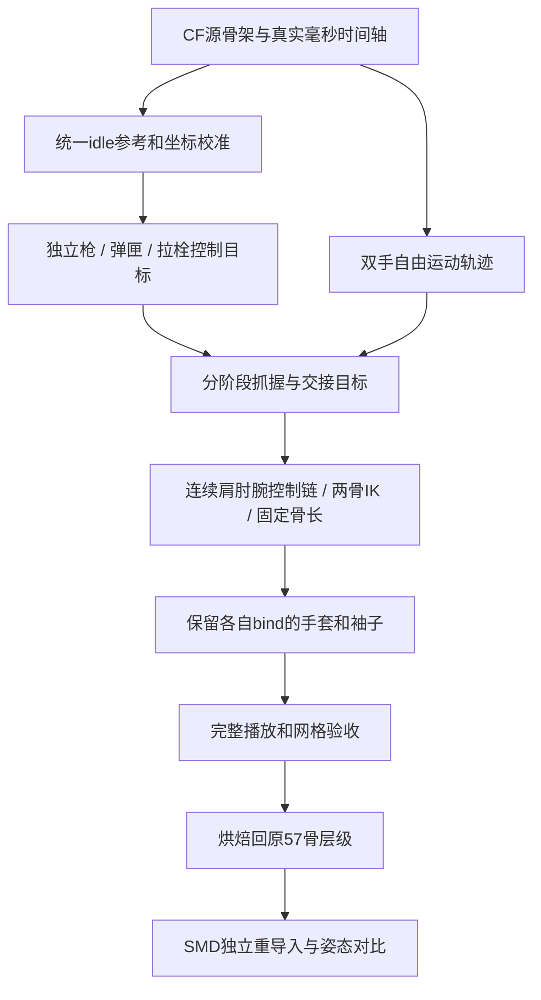

# P7-S04 切枪 / 换弹修复操作单 — Grok 4.6

用户 2026-09-13 要求：先把修复路径写清楚，再让本机 Grok 4.6 操作。本次将 task 从短指针改为详细操作手册；**当前执行阶段与开关仍只由 [plan.md §0.2](plan.md) 控制**。后续步骤不是同时开工的授权。

执行器：`D:\software\grok build\grok.exe`；模型 ID **`grok-4.6`**，已经通过本机 `grok models` 核实。基线 master `bbc0a73`。旧报告中的 `FIXED_OFFLINE` / `FIXED_IN_BLENDER` 都没有用户接受，不能沿用为成功。

## 1. 目标、当前阶段与保护范围

最终目标：保留雷神 CF 切枪/换弹的枪械运动、动作顺序和时间，使当前 CS 手套/袖子正确参与，握持不滑脱、肩肘腕不拉长、弹匣交接连续、结束能接回统一持枪位。

**先执行 R1-A，即下文 G0–G1，完成后交回 Review。** 先建立可回退现场、真实时间轴和源动作对照；G2–G5 是后续修复路径，需 Reviewer 更新阶段后执行。旧“不改动先”继续保护旧文件；本次请求允许 Grok 在新副本内按当前阶段操作。

- 旧 blend、旧 SMD、旧脚本、live addon 保留。未保存内容必须先从 Blender Save Copy，不能仅复制磁盘文件。
- 不调用 `p5_p7_s04_cf_animation.py` 的 main：它会编译和部署。不调用 `p5_p7_s04_fix_retarget.py` 的 main：它会覆盖旧 SMD/报告。
- 不运行原版 `build_p7_s04_blender_current.py`：它会删除当前对象/Collection/Actions，并覆盖旧 blend。
- 不重启/关闭 Blender，不改 Inspect、world/dropped、声音 WAV、材质，不启动 CF，不向游戏部署。
- 本轮只写 `work/p5_leishen/p7_s04_r1/`。禁止向 Git 提交 data、CF 原始 binary、已有用户修改或无关文件。

## 2. 为什么前两版仍不通过

证据：[现场只读记录](work/p5_leishen/p7_s04_review_20260913/live_scene_readonly.json)、[可复跑审计](work/p5_leishen/p7_s04_review_20260913/audit_inputs.py)、[数值结果](work/p5_leishen/p7_s04_review_20260913/offline_audit.json)。以下是本次测量，不是修复后 Gate。

| 问题 | 已见证据 | 修复要求 |
|---|---|---|
| 每段 clip 的首帧都重置为 CS hold | 两版都取 `cf_worlds(..., clip, 0)`。原始 select 首帧枪根距 idle 4.98188 CF 单位，末帧距 idle 约0.00002 | 统一用 CF idle 校准所有 clips；保留 draw 的进入运动，验证末帧到 hold。禁止把 draw 首帧=hold 当通过 |
| 上肢仍不连续 | 第二版 reload 的 UpperArm→Forearm 关节点距离：左8.4125–18.3890，右14.7555–22.2496；draw 左10.2213–14.5286、右14.6615–21.1990 | 检查完整肩肘腕链。这是关节点距离，不是 Blender Bone.length；腕长/单段指长固定仍会漏掉上臂/袖子问题 |
| 导出骨架不是正常 IK 链 | live 57骨 rig 两侧 Forearm 是根骨；Hand 是其子骨；UpperArm 在 Clavicle 下，ForeTwist 也是根骨 | 另建连续控制链，不能直接在导出 rig 上加 chain_length=2 并认为包括 UpperArm |
| Blender 播放速度错 | live 30 FPS；switcher 只改 action/slot/range。draw 播成1.0秒而非0.64秒，reload 播成3.5667秒而非1.6秒 | 根据 times_ms 建时间轴。不要把 key index 当时间，也不要只改 frame_end |
| 无接触阶段 | apply_rel_change 给手叠相对运动，没有握枪/抓匣/松手/拉栓状态 | 分阶段设置手目标及接触 anchor，检查位置和方向；不能整段锁右手到枪、左手到匣 |
| 旧 Gate 太弱 | gun-hand 变化只要求<8 Source单位，只测一段指骨/腕长，report仍写FIXED | 新 Gate 测全链、接触、蒙皮网格、首末连接和完整播放；数字通过只能 READY_FOR_REVIEW |
| 旋转约定待查 | reload 左手 key96 quaternion 范数0.990741；quat_xyzw_matrix 未归一化，后续直接转Euler | 核查源loader约定，测RᵀR/determinant，用合成旋转例验证归一化；保留原值，不直接改原始数据 |

已排除/限定的方向：

- **本轮输入不是读错 REZ 分包**：`rez2/RF016.REZ` 目录 MD5匹配；压缩payload SHA256=`a0ccef5deed745f1731eb93295c630f531123288055f3c3790531b99b6e401b8`，LZMA解压体 SHA256=`511dec8d2401a1886ddecd14b4f18e17ac0afbefd943f6dc11a3fd2f82ef6b49`，与当前P6输入逐字节相同。两个SHA属于不同层，不能混比后误判损坏。
- `parse_smd_skeleton()` 一直覆写到最后一帧，有通用缺陷；但当前P7-S02 idle的time0/time1完全相同，**不是这次姿势失败的直接原因**。新parser仍应显式按帧读取。
- Action Slot当前已绑定：`3_draw`→`OBdraw`。不重复“只修slot”；不用零用户、多slot的 `P7S04_CURRENT` 当当前动作。
- 旧side截图大量裁切/遮挡，不能证明完整动作正确。改相机只能改善观察，不能算动作修复。

## 3. 输入与执行入口

仓库根 `D:\project\cf_to_csgo`。下列路径均相对此根；执行时解析为绝对路径。

| 用途 | 路径 / 对象 |
|---|---|
| 冻结scene | `work/p5_leishen/p7_s04/blender/p7_s04_current.blend` |
| 连接正在运行的Blender | `127.0.0.1:9876`；`scripts/cf_ltb/blender_mcp_exec.py` |
| CF动画body | `work/p5_leishen/p6/verified_root/Models/PLAYERVIEW/PV-M4A1_S_Transformers.LTB`，604808字节 |
| 目标57骨mesh/bind | `work/p5_leishen/p7_s04/source1/cf_leishen_m4a4.smd`，骨名/父子表保持不变 |
| 目标hold动作参考 | `work/p5_leishen/p7_s02/source1/v_rif_m4a1_anims/idle.smd` 的time0，**不等于mesh bind pose** |
| 手套bind | `work/m4a1_s_bornbeast/blender_arm_reference/decompiled/glove_fullfinger/v_glove_fullfinger.smd` |
| 袖子bind | `work/m4a1_s_bornbeast/blender_arm_reference/decompiled/sas/v_sleeve_ct.smd` |
| 坐标基准 | `assets/weapons/m4a1_s_bornbeast/c3_alignment_m4a4_manifest.json`；先C3，再Source X=0镜像，禁止重复镜像 |
| 旧算法只读研究 | `scripts/p5/p5_p7_s04_cf_animation.py`、`scripts/p5/p5_p7_s04_fix_retarget.py` |
| 唯一新输出根 | `work/p5_leishen/p7_s04_r1/`，分 `scripts/ baseline/ source/ controls/ bake/ review/` |

关键对象：`CS_M4A4_Armature`（57骨）、`CF_GUN_P6`、`CS_GLOVE_Armature`（48骨）、`CS_SLEEVE_Armature`（18骨）。手套/袖子保留各自bind rig、权重和inverse bind，通过同名骨最终姿态跟随，**不重新自动蒙皮**。

关键映射：`FvARM-bone Prop1`→`v_weapon.M4A1_Parent`，`Bone06`→`v_weapon.M4A1_Clip`，`Bone04`→`v_weapon.M4A1_Bolt`。Source枪根在右手之下，CF枪根和手臂分支是兄弟；控制层不能照抄导出层层级。

## 4. 分阶段操作



枪轨迹先独立正确，再让双手按接触阶段跟随；原57骨层级只承担最终兼容输出。当前只执行最上游的源对照。

### G0 — 保存现场并建立新副本（R1-A当前允许）

1. 再查Git status、plan阶段、`bpy.data.filepath/is_dirty`、action/slot、frame/FPS、对象矩阵、NLA、constraints和modifiers。Reviewer看到的是Blender5.2.1 LTS、draw frame25、30 FPS、is_dirty=true；执行时可能已变化，不要硬编码这些状态。
2. 用Blender Save Copy保存 **内存中的未保存场景** 到新 `baseline/live_unsaved_<timestamp>.blend`，确认成功且非空后继续。只复制旧磁盘文件不合格；不得在旧filepath上save_mainfile。记录旧blend/SMD/脚本SHA，操作前后旧文件不变。
3. 建立新的 `baseline/working_<timestamp>.blend`，将后续操作切到新副本；目标存在就另取唯一名字。保留旧结果为 `REJECTED_BASELINE`，不删除对象/Actions，不用全场景清理。
4. 新脚本只操作明确前缀的新对象/Action。记录当前选择/帧/播放状态。没有MCP连接就停止Blender写入，不重启服务猜修。
5. 输出 `baseline/preflight.json`：版本、dirty、backup/hash、旧文件hash、骨架拓扑、action+slot、各mesh唯一deform rig、matrix、NLA/constraint列表。

### G1 — 建真实源动作/时间轴对照（R1-A当前允许）

1. 重跑Reviewer `audit_inputs.py`；只读通过校验的body，记录压缩/解压双SHA、57节点/8clips、select/reload的times_ms/事件。只导入旧模块函数，不调用main。
2. 在新副本建 `CF_SOURCE_REFERENCE`：先用CF原始层级画骨骼/关节点、枪根/弹匣/拉栓坐标轴，按CF local→world累乘得到姿态。旧retarget SMD不能充当原始CF对照。检查轴向、左右手、quat分量顺序、local/global/bind矩阵含义。
   - **bind不要求等于当前文件任一clip首帧**。旧源码“第一导出帧”注释不能证明资源后续未重排/换动作，也不能据此拟合坐标。先用SDK约定、齐次矩阵合法性、层级和合成旋转验证；再把bind与各clip的差异作为结果记录。禁止按“所有clip首帧离bind最近”自动挑选行列/旋转约定。
   - 旋转角公式只用于单位正交旋转。raw非单位quat矩阵应报告正交误差/行列式；如经polar decomposition比较朝向，明确标为提取后的旋转。归一化影响必须是同一clip/帧/骨的raw与unit之差，不能拿各自动作总行程替代。
3. `data/p5_t02_native/geom/...geometry.json` 只有mesh/vertices/triangles/UV/normals，**没有权重和inverse bind**。可展示静态形状；不能按最近骨随便绑定后宣称原生CF蒙皮成功。本轮允许明确的 `SKELETON_ONLY_REFERENCE`；完整原生手模对照需另解析LTB权重/bind并验证。
4. 建一套真实时间轴，例如诊断scene用 **100 FPS**，`frame=time_ms*100/1000`，源key允许小数帧。位置按源时间插值；旋转约定核实后，用单位quaternion最短弧slerp，做q/-q连续化。100 FPS是本任务诊断选择，不是CF原始采样率。整帧SMD导出留到G5。
   - 显式源采样器负责SLERP；不能把四个分量设LINEAR便声称等价。测Blender中间帧与采样器位置/角度误差，必要时加密烘焙并报告误差。
   - 新解析保留节点flags。Planner实测本输入57个flags均0，未启用rotation-only；不要追它作本次根因。引擎代码线索和版本边界见[补充核查](work/p5_leishen/p7_s04_review_20260913/source_convention_research.md)。
5. 核查原始select末帧、reload末帧与idle0枪/左右手几乎同位（实测位置误差<0.0001 CF单位），补测旋转闭合误差。保留select首帧枪距idle4.98188的进入运动；此轮不要修改旧目标动作来满足它。
6. 用固定检查相机显示完整动作，另设固定侧/顶视角。不可每帧追着枪重取景。标明source/target、毫秒、原始key index。场景包含参考骨架轴线，必须可见且可播放。
7. 输出 `source/source_audit.json`、`source/source_reference.blend`、`source/timeline.json`、完整可见的检查图/短视频。若只能骨架对照必须注明；quat或解码约定无法验证则具体标OPEN，不能继续用IK掩盖。

**R1-A到此停止**，交付 `review/r1a_report.md`、`review/r1a_result.json`。最多 `SOURCE_REFERENCE_READY_FOR_REVIEW`，不写ANIM_FIXED。Reviewer检查备份、来源、时长、端点、quat和视野后再开G2。

### G2 — 公共参考姿态 + 独立控制骨架（后续R1-B）

1. 分开CF bind/rest、CF公共idle姿态、CS mesh bind、CS hold pose。每个映射骨记录静态轴向/roll校准。不能把hold世界矩阵写成骨架rest，也不能给每个clip重新校准到首帧。
2. 列向量约定下，枪根目标以共同CF idle参考 `t_ref=0` 开始验证：

   ```text
   T = mirror_SourceX0 @ C3
   G_target(t) = T @ G_CF(t) @ inverse(G_CF_idle(t_ref)) @ inverse(T) @ G_CS_hold
   ```

   此式只给枪根控制目标，不无条件套全部手臂。测参考时刻恒等、select末帧→hold、已知平移/90°旋转、一次镜像、determinant/scale。尺度用于位移；提取旋转前需核查刚体性，不能把反射矩阵直接转quaternion。
3. 建独立 `CTRL_Weapon / CTRL_Magazine / CTRL_Bolt` 世界目标。控制Empty不挂在R_Hand下，避免手跟枪、枪又跟手的循环。枪/匣/栓各只有一个权威运动源，先验证轨迹再加手。
4. 新建正常肩→上臂→前臂→手的 `CTRL_Arms`。骨长来自目标手套/袖子的真实bind与可接受hold；固定长度、设elbow pole/腕朝向/twist，**只在这套连续链上做两骨IK，关闭stretch**。超出可达范围先报告肩/目标/长度；可做有记录的肩躯干补偿，不能拉长骨头够目标。
5. 原57骨导出层级不变，将控制rig最终世界姿态换回每个输出骨自己的父local；Forearm根骨单独处理。手套/袖子保留各自bind，避免叠加第二次物体变换。
6. 先验hold、select末帧、reload末帧三点：同一持枪、方向正确、肩肘腕连续、mesh不双变换。失败就停在空间/骨架层，不进局部修帧。

### G3 — 分阶段处理抓握与交接（后续R1-B）

接触目标同时包含**位置和方向**。在握把、护木、弹匣抓握区、拉栓建立局部anchor，不能只用骨原点距离。锁定阶段 `Hand_world=Object_world @ Grip_offset`；offset在合格接触帧标定，放手阶段用CF轨迹作目标。切换时求保持world pose的offset，平滑权重/旋转，检查速度突变；一个对象一个主驱动，不互相追逐。

先修切枪：

1. 保留t0入场位置，**不强制hold**。源数据是枪起始在外、右手却靠近idle，所以不能整段把右手焊在枪上。
2. 从源动作确认哪只手、何时抓握或操作拉栓；`WeaponReload@277ms`只是事件线索，不证明接触手或接触对象。
3. 固定镜头检查进入轨迹、277ms机械动作和640ms→idle的姿态/速度连接。先让切枪通过，不同时调两段和相机抵消错误。

换弹按下表分段。原始key只用来对照，重采样后不能仍当新帧号：

| 时间 / 原始key | 检查 | 操作要求 |
|---|---|---|
| 0–194ms / 0–13 | 支撑手离开、抓匣准备 | 根据源轨迹标接触起点；ClipOut音效不等于开始抓握 |
| 194ms / 13附近 | 弹匣脱离 | 抓握阶段手–匣相对姿态固定，空闲手不被错带走 |
| 194–718ms / 13–48 | 取出/转移/送回 | 锁定时不滑脱，释放时解除；离屏动作保时长，不整段焊死 |
| 718ms / 48附近 | 插匣/锁定 | 弹匣接回枪局部目标，切换前后world pose连续，手随后释放 |
| 1211ms / 81附近 | 拉栓/机械操作 | 先确认操纵手，再到bolt anchor；允许真实换握，不能用手枪距离变小代替正确 |
| 1585–1600ms / 106–107 | 回稳 | 枪、双手、弹匣、拉栓连续接公共idle；检查最后数帧速度 |

手指先保持目标长度、校准掌面/指向，再做弯曲；检查全部指骨。袖子灰影要查spine/clavicle/upperarm变形及权重覆盖，不准隐藏袖子当成功。

### G4 — 数值、网格和完整播放验收（后续R1-C）

阈值预先写 `review/gates.json`。以下是工程初始建议，不是CF官方容差；尺度变更须先解释，不能为已有失败放宽阈值：

- duration误差≤1ms；100FPS小数源key可精确保留时间。整帧导出事件误差≤半个目标帧。慢放另标倍率，不能拿旧错误速度当慢放。
- 全部实际肩肘腕段长度对标定值误差≤0.5%，全手指也测。导出rig的根节点之间仍要测几何关节点距离。
- 接触锁定阶段anchor位置误差≤0.1 Source单位、朝向≤3°；自由阶段不套。还要看evaluated掌心/指节网格，anchor合格不代表不穿模。
- 末帧→公共hold位置误差≤0.05 Source单位、方向≤1°，同时列出源自身误差。quat有限/单位化，无非预期scale/shear、pole翻折、twist跳变。
- 查全帧极值/突变，重点draw 0/277/640ms，reload 0/194/718/1211/1585/1600ms及接触切换前后±1采样帧。
- 必须交固定第一人称与固定侧视完整播放，包含手套/袖子、匣/栓；另给0.25倍慢放，不只挑几张好看的静帧。

工程检查通过最多 `BLENDER_CANDIDATE_READY_FOR_USER_REVIEW`；draw和reload要分别由用户视觉接受，不能替用户勾选。

### G5 — 烘焙和SMD等价性（后续R1-C，不含部署）

1. 新副本中把控制rig的 **evaluated final pose** 烘焙到原57骨；保留控制版。不得导出尚未计算constraints的原始matrix_basis。
2. 区分object/world、armature pose、parent local、mesh inverse bind。优先核对当前API的 `Bone.convert_local_to_pose(..., invert=True)`，传入骨/父rest和父pose；根骨走独立分支。
3. 手写SMD时按原拓扑求 `local=inverse(parent_world)@bone_world`，根直接取本空间world；保持骨名/父编号。Blender骨轴与SMD导入器轴修正须往返验证，不能只比较Euler数值。
4. 仅写 `p7_s04_r1/bake/`；独立新场景重导入SMD、关闭控制驱动，逐帧比较世界骨矩阵和evaluated mesh抽样顶点。确认没丢slot/root运动、没双镜像/重算bind。
5. 骨名/父表、mesh/UV/材质/权重保持一致；保存 `bake/roundtrip.json`。音效事件用源毫秒投到新采样帧，既有WAV不改。
6. **不部署**。Blender用户接受、SMD往返通过后，由下一轮plan安排isolated compile、游戏Gate及声音复核。

## 5. 失败分支

| 失败 | 停在哪一层 | 下一步 |
|---|---|---|
| 输入hash/解压不一致 | G1 | 查两层hash、archive/entry，保留原文件 |
| 源骨架扭曲/时序错 | G1 | 骨索引/父链、local/global、quat范数、基准旋转；先修parser |
| 源正确，枪末帧不回hold | G2 | 查公共参考、T顺序、clip0重置/双镜像 |
| 枪对，手够不到 | G2/G3 | 查肩位置、目标距离、两段长度、pole/接触阶段；不拉骨/乱移整场景 |
| 骨对，手套/袖子变形 | G3 | 查deform rig、inverse bind、同名骨world、modifier双变换；不自动刷权重 |
| Blender对，SMD错 | G5 | 查parent-local/pose空间、轴补偿、root/fps/slot；不进游戏试错 |

一次只改一个可说明的因素，记录 `hypothesis → change → expected → measured`，保留before/after和失败结果。不连续叠偏移直到某镜头看着好。禁止 `--always-approve`、`bypassPermissions`、`--restore-code`、Git reset/clean 或擅改系统权限。

## 6. Grok入口和交付格式

**当前执行记录**：session `01a098c9-1818-74f1-b82a-b3e9976e433b`，G0已由Grok完成且Planner独立复核通过（[检查结果](work/p5_leishen/p7_s04_r1/review/planner_g0_review.json)）。当前工作文件是 `work/p5_leishen/p7_s04_r1/baseline/working_20260913_113051.blend`，未保存现场备份是同目录 `live_unsaved_20260913_113051.blend`。**不重跑G0**。G0脚本把失败条件放在事后报告；本次保存实测成功，但不可复用这种控制流。后续写入前必须assert正确工作路径、冻结hash及新目标不存在，保存成功并验证后才可继续。

首轮16轮大任务耗在阅读，仅完成查询；收窄到G0后完成备份。因此后续采用“单个小脚本→执行→输出证据→Planner复核”，G1先查矩阵/quaternion/时间约定，再建可见源对照。当前动画仍REJECTED。

**最新：G1离线审计已经由Grok执行，达到8轮上限停止，复核为CHANGES_REQUIRED。** 没有source_reference.blend。当前 `source_audit.json` 的bind-relative next_verification_step已被Planner否决，不得直接照做；下一小检查点的7条明确操作见[执行复核与续作单](work/p5_leishen/p7_s04_review_20260913/grok_execution_review.md)。不得只读旧JSON的next步骤，跳过此纠正。

本机Python：`C:\Users\Administrator\.cache\codex-runtimes\codex-primary-runtime\dependencies\python\python.exe`。用项目TCP bridge操作Blender，不用鼠标猜Pose/Action状态。

```powershell
# 只读审计，Reviewer已经运行通过
& 'C:\Users\Administrator\.cache\codex-runtimes\codex-primary-runtime\dependencies\python\python.exe' -B work/p5_leishen/p7_s04_review_20260913/audit_inputs.py

# 只执行plan开启的R1-A；勿重复启动已在运行的同一执行单
& 'D:\software\grok build\grok.exe' --cwd 'D:\project\cf_to_csgo' --model grok-4.6 --no-subagents --max-turns 16 --prompt-file 'D:\project\cf_to_csgo\work\p5_leishen\p7_s04_review_20260913\grok_r1a_prompt.md'
```

`r1a_result.json` 至少含：task_id、model、stage、status、original_scene_sha_unchanged、unsaved_backup_path、source_hashes、time_mapping、source_end_vs_idle、quaternion_findings、reference_kind（skeleton-only/full-skinned）、artifacts、failed_checks、next_review_question、compiled=false、deployed=false、user_accepted=false。

Planner协调本机运行时，Executor只产出本轮目录，**不并发commit/push**；由Planner审查后精确提交。R1-A完成就退出，不自行开G2。

## 7. 官方实现参考

- [Bone.convert_local_to_pose](https://docs.blender.org/api/3.5/bpy.types.Bone.html)：bone/parent rest和parent pose的空间转换；本机5.2.1调用前核查实际RNA签名，旧文档只解释空间含义。
- [Blender IK Constraint](https://docs.blender.org/manual/id/4.5/animation/constraints/tracking/ik_solver.html)：chain length、pole、stretch和IK求解顺序；需真正连续的控制链。
- [Bake Action / Visual Keying](https://docs.blender.org/manual/it/latest/editors/nla/editing/strip.html)：烘焙包含constraints后的最终变换，再验SMD往返。

联网核查2026-09-13。文档支撑工具用法；本项目的控制rig/接触阶段方案来自代码与现场分析，尚未证明最终修复成功。
